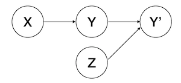
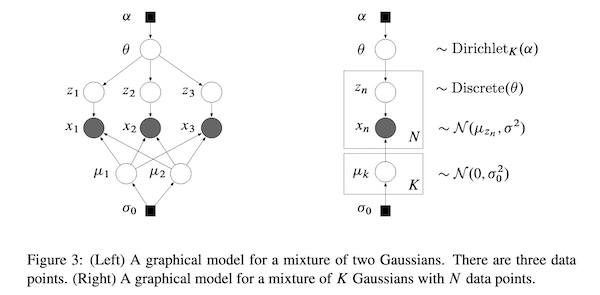
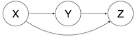
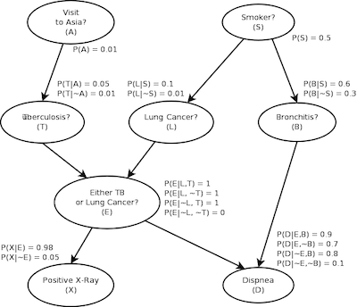

# Causal Machine Learning - Lecture 1

#### May 8th, 2019
#### Prof. Robert Ness

## 1. Introduction

Discovering the direction of causality has been of interest for scientists for a long time. In many domains like physics, echonomics, biology, social science, computer science, anthropology, epidemiology, statistics, researchers devote many years of their lives to discover and validate a single direction of cause in a big system. 

Part of the problem is, most of what we observe is biased. For example, in late 80s and 90s, doctors used to prescribe [Hormonal replacement therapy](https://www.mayoclinic.org/diseases-conditions/menopause/in-depth/hormone-replacement-therapy/art-20047550) to old women. Experts believed that at the lower age, women have a lower risk of heart disease than men do, but as they age, after menopause, their estrogen level decline. But after doing a large randomized trial, where women were selected randomly and given either a placebo or estrogen, the results showed that taking estrogen slightly increases the chace of getting heart disease!

The other problem with modeling causality is *counterfactuals*. In simple words, counterfactual is imagining something that didn't actually happen. For example, had I broken up with my girlfriend sooner, I would be much happier today. Had I studied harder for my SATs, I would be in a much better school today. This is fundamental to how we as a human reason. For a machine, this is a missing data problem. You don't have counterfactual outcome in your training data. How do we train our famous deep models if there is no label from the world where I broke up with my girlfriend sooner?

In biology and medicine, randomized clinical trials are a gold standard of discovering the causal effect of a treatment. Similar to the example we gave earlier, we select two random groups, and we give treatment to one group (called treatment group) and we give placebo to the other group (called control group). But we don't have the luxury of setting up the experiments in many other domains. For example, stock market. This course focuses heavily on use cases of tech industry, where we have liesure of performing some experiments on the product.

This course is inclined towards machine learning in the following two ways.

* To base causal inference firmly in the intuition about generative modeling. i.e., you will be able to see causal models as a type of generative models. This is important because in order to build the next generation of generalized intelligence, we have to figure out how to make machine think counterfactually. We will cover techniques that makes deep generative models reason about counterfactually outcomes.

* The focus of tech industry is shifting towards problems where A/B test becomes more complicated and not feasible. We will cover some advanced techniques like how to deal with confounding, how to build up an online and offline learning and policy evaluation for markov decision processes that automates testing. We will also cover a little bit of relevant literature from Game theory (Auction models) and Reinforcement learning (policy evaluation and improvement) at the end.

Causal inference spans to many other concepts and we won't be able to cover all of them. Though the concepts below are important, they are out of scope for this course.

* Causal discovery
* Causal inference with regression models and various canonical SCM models
* Doubly-robust estimation
* Interference due to network effects (important in social network tech companies like Facebook or Twitter)
* heterogeneous treatment effects
* deep architectures for causal effect inference
* causal time series models
* algorithmic information theory approaches to causal inference


### Readings

This course does not require you to purchase the textbooks.  However, it will rely heavily on the following books:

* Pearl, Judea. *Causality*. Cambridge university press, 2009.
* Peters, Jonas, Dominik Janzing, and Bernhard Schölkopf. *Elements of causal inference: foundations and learning algorithms*. MIT Press, 2017.
While not necessary for the course, these books are worth buying just to have as a reference.
* Scutari and Denis's _Bayesian networks: with examples in R_, publish Chapman and Hall in 2014.

## 2. Causal modeling as an extension of generative modeling


### Generative Vs. Discreminiative Models

Let's focus on supervised learning for a moment. We know from our machine learning course that, a discreminiative model directly estimates the likelihood $P(Y \mid X)$. The goal here is, how to best distinguish the classes or estimate y given the observation.

Generative model learns the joint distribution $P(X, Y)$ underlying the data. We will discuss this more in later lectures. In simple words, these models can generate data that looks like real data.

Why we are focusing on generative models? Because the physical causal mechanisms is the reason why we observe something. For example, a city with high altitude will experience lower termperature. In other words, these causal mechanisms generate data. Thus, **a causal model is a generative model**!

### Model-based Machine Learning

Reinforcement learning techniques can be divided into two segments. 

1) Model-free RL: where agent only experience the effect of their action.

2) Mode-based RL: where along with the experienced rewards, agent also knows the mechanics of the environment (Transition function for Markov Decision Processes).

In supervised learning, we evaluate bunch of models with some statistics or goodness of fit. If we don't meet the target, we change and transform the feature such that we meet the target. We mutate the data until we fit the model of our choice.

What is missing here is, *a deep thought about how the data is actually generated.* Let's understand this with some examples.


#### Linear regression:

$$Y = \beta X + \alpha + \epsilon\text{, }\epsilon \sim \mathcal{N}(0,1)$$

This system of equation translates that $X$ causes $Y$. Note that a regression model does not care about the directionality. We could also predict $X$ given $Y$. The equation above gives us a story about how $X$ and $Y$ were generated. 

suppose the data generation process follows the same model, but we observed $Y'$ instead with some technical noise/measurement variation. Now it becomes noise model.

$$Y' = Y + Z\text{, } Z \sim N(0,\sigma^2)$$

Now, causal structure becomes



#### Logistic Regression:

$$\mathbb{E}[Y] = \texttt{logit}(\beta X + \alpha)$$

Here, $Y$ is causing $X$. In other words, $Y$ is the reason that we observe $X$ in the corresponding subspace.

In opposed to this, **Naive Bayes classifier**, we use Bayes rule to reverse the inference to get to $Y$.


Many other generative models incorporate the story of data generating process. Let's review a few of them.

#### Gaussian Mixture Model:



**Recap**: Let's recap the intuition with simple GMM with two gaussians. We observe the data and realize that it is comming from two Gaussians with mean say $\mu_1$, and $\mu_2$. Now Let $Z_i$ be a binary variable that says $X_i$ belongs to one of these distributions.

 **Story**: 
  
  * Some probabilistic process generated $\mu$.
  * Some other Direchlet process generated $\theta$. 
  * Then a discrete distribution with parameter $\theta$ generated $Z_1$.
  * $Z_1$ and all the $\mu$ generated $X_1$.
 
We can code this story real quick in a modern probabilistic programming language.
 
 ```python
 alphas = 0.5*torch.ones(K)
 theta = sample('theta', Direchlet(alphas))
 
 for each Mixture component k: 
 		mu[k] = sample('mu_k', Normal(0, Sigma))
 
 for each data_point:
 		Z[i] = sample('Z_i', Discrete(theta))
 		X[i] = sample('X_i', Normal(mu[Z[i]], scale))
 ```
 
 The plate model shows exactly this narrative which can be casted as a graphical story of how the data is generated. In fact, any plate model like Hidden Markov model, mixed membership models like LDA, Linear factor models exactly cast the story of how the data is generated. **A probabilistic program can be seen as a discription of data generating process.** In the next lecture, we will cover basics of *Pyro* - a PyTorch based probabilistic programming language (PPL). We will also learn to code these well known models into PPL.


#### Deep Generative models:

Deep generative models like VAEs don't tell a data generation story, they rather collapse everything into some latent encoding. They undoubtly generate data very accurately. Moreover, disentangled VAES attempt to learn the latent variables that are disjoint and broken and explain different things. This is a good step towards data generating process, why not making all the way through and try to describe them as generative story for the things we know and care about in the machine learning process.


#### Inferring the correct story is really hard!

We can think of deep models as to models that learn optimal circuit given input signal and output channels. In contrast, data generating process, you're writing a program. Inferring a program is a lot harder than inferring a circuit. In fact, that is an ill-specified problem, because there are numerous programs we could write to generate the same data. From Algorithmic information theory, finding the shortest program that generates the output is an NP-hard problem.

This is where domain knowledge comes to rescue! Let's say an economist has some models in mind about supply and demand, or he wants to test some behavioral or cognitive model. Every model that stood the test of time, is backed by extensive research and is validated rigorously. And just like we can test a machine learning model, we can test the performance of the model after updating with the modeling assumptions from domain knowledge.


#### Inferring Latent variables is also hard!

The well-known generative models like GMM, we have nice modeling assumptions that enable fast inference. In general, inference is hard. Probabilistic machine learning community focuses heavily on tricks like conjugate priors, conditional independence that makes inference easy. We can consider all of those tricks as modeling assumption, thus part of the story of our belief of how the data was generated. 

Once we are done with the story, PPL should be able to do out-of-the-box inference.

## 3. Causal Bayesian Networks:

Bayesian network explicitly models a joint distribution by factorizing it to conditionals. We can represent the factorization with a DAG (Directed Acyclic Graph). We will cover them in depth in later lectures. There can be multiple different factorizations that represents same distribution. For example, we can prove that all of the factorizations below entail same joint distribution over $X$, $Y$ and $Z$.


$P(X,Y,Z) = P(X\mid Y)P(Y\mid Z)P(Z)$


$P(X,Y,Z) = P(Z\mid Y)P(Y\mid X)P(X)$


$P(X,Y,Z) = P(Z\mid Y, X)P(Y\mid X)P(X)$



So the question is, which factorization should we choose? It's simple, whatever fits our belief of the story of how the data should be generated. Then, the directions follows causality. We call them Causal Bayesian networks. Here is the famous example of Lung cancer Bayesian network. We could entail the same distribution with the *visit to Asia* to *Lung Cancer*, but we know that *Visit to Asia* does not cause *Lung Cancer*.



#### Inference in Bayesian network

We are not going to focus too much into inference algorithms in this class, but it is important to note that they are important and often hard. Below are some of the simplest inference techniques for the Bayesian network above. 

**Suppose we observe positive X-Ray. How do we infer that a person has tuberculosis?**

One way for this is computing the conditional probability and marginalize appropriately according to the query. Here, $\sum_A$ means marginalize over $A$.

$$P(T \mid X) = \frac{P(X,T)}{P(X)} =  \frac{\sum_{A, L, E, S, B, D}P(A, T, L, X, E, S, B, D)}{\sum_{A, L, T, E, S, B, D}P(A, T, L, X, E, S, B, D)}$$

As you can see, this is not always scalable and becomes harder as the network size grows. Also, this approach is viable when all the variables are discrete. Things become complicated when variables are continuous.

The other way is sampling techniques. In rejection sampling, if the observation doesn't match with what we're looking for, we throw them out. So for this question, we will reject all the samples who had negative X-Ray.

As we saw while coding GMM story, it has for loops and other complicated things. Inference of unobserved latent variables on these programs are a lot harder and we generally use advanced sampling techniques like HMC.